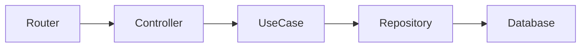

# Metodología de Documentación del Proyecto Goluti Backend Platform

**Versión**: 1.0  
**Fecha**: Noviembre 2024  
**Estado**: Vigente

---

## Tabla de Contenidos

1. [Propósito](#propósito)
2. [Metodología Aplicada](#metodología-aplicada)
3. [Estructura de Documentación](#estructura-de-documentación)
4. [Convenciones de Nomenclatura](#convenciones-de-nomenclatura)
5. [Tipos de Documentos](#tipos-de-documentos)
6. [Plantillas y Formatos](#plantillas-y-formatos)
7. [Control de Versiones](#control-de-versiones)
8. [Guía de Actualización](#guía-de-actualización)

---

## Propósito

Este documento define la metodología y convenciones utilizadas para documentar la arquitectura, flujos y componentes del **Goluti Backend Platform**. Su objetivo es:

- Establecer un estándar consistente de documentación
- Facilitar el entendimiento del sistema para nuevos desarrolladores
- Proporcionar referencias técnicas precisas y actualizadas
- Documentar decisiones arquitectónicas y patrones de diseño
- Crear una base de conocimiento mantenible y escalable

---

## Metodología Aplicada

La documentación del proyecto adopta una **metodología híbrida** que combina los mejores elementos de:

### 1. **RFC (Request for Comments)**
- Especificaciones técnicas detalladas y formales
- Secciones claras: Abstract, Introducción, Especificación, Ejemplos, Referencias
- Numeración de documentos para trazabilidad
- Control de versiones y estado de cada documento

### 2. **Arc42**
- Estructura arquitectónica clara y comprensible
- Documentación de contexto, bloques constructivos y conceptos transversales
- Descripción de decisiones arquitectónicas fundamentales
- Vistas arquitectónicas múltiples (lógica, física, despliegue)

### 3. **C4 Model (Conceptual)**
- Diferentes niveles de abstracción: Contexto, Contenedores, Componentes, Código
- Diagramas de flujo de datos
- Mapeo de dependencias y comunicación entre componentes

### 4. **Domain-Driven Design Documentation**
- Documentación del modelo de dominio
- Bounded contexts claramente definidos
- Ubiquitous language en toda la documentación

---

## Estructura de Documentación

La documentación está organizada en carpetas numeradas que siguen un orden lógico de comprensión del sistema:

```
docs/
├── 00-methodology/          # Metodología y guías de documentación
│   └── 00-00-documentation-methodology.md
│
├── 01-architecture/         # Visión general de la arquitectura
│   ├── 01-00-architecture-overview.md
│   ├── 01-01-clean-architecture-principles.md
│   ├── 01-02-project-structure.md
│   ├── 01-03-layers-and-responsibilities.md
│   └── 01-04-dependency-flow.md
│
├── 02-entity-flow/          # Flujo CRUD de entidades
│   ├── 02-00-entity-flow-overview.md
│   ├── 02-01-entity-models.md
│   ├── 02-02-entity-use-cases.md
│   ├── 02-03-entity-repositories.md
│   ├── 02-04-entity-controllers.md
│   ├── 02-05-entity-routers.md
│   └── 02-06-entity-flow-examples.md
│
├── 03-business-flow/        # Flujo de lógica de negocio
│   ├── 03-00-business-flow-overview.md
│   ├── 03-01-business-models.md
│   ├── 03-02-business-use-cases.md
│   ├── 03-03-business-controllers.md
│   ├── 03-04-business-routers.md
│   ├── 03-05-auth-flow-specification.md
│   └── 03-06-business-flow-examples.md
│
├── 04-core-components/      # Componentes core del sistema
│   ├── 04-00-core-overview.md
│   ├── 04-01-configuration.md
│   ├── 04-02-middleware.md
│   ├── 04-03-wrappers.md
│   ├── 04-04-enums.md
│   ├── 04-05-models.md
│   └── 04-06-utilities.md
│
├── 05-infrastructure/       # Infraestructura y persistencia
│   ├── 05-00-infrastructure-overview.md
│   ├── 05-01-database-configuration.md
│   ├── 05-02-database-entities.md
│   ├── 05-03-mappers.md
│   ├── 05-04-repositories-implementation.md
│   └── 05-05-migrations.md
│
├── 06-api-reference/        # Referencias de API
│   ├── 06-00-api-overview.md
│   ├── 06-01-authentication-api.md
│   ├── 06-02-entity-endpoints.md
│   ├── 06-03-list-services-specification.md  (ya existe)
│   ├── 06-04-request-response-formats.md
│   └── 06-05-error-handling.md
│
├── 07-patterns-and-practices/ # Patrones y mejores prácticas
│   ├── 07-00-coding-standards.md
│   ├── 07-01-error-handling-patterns.md
│   ├── 07-02-transaction-management.md
│   ├── 07-03-security-practices.md
│   └── 07-04-testing-guidelines.md
│
└── 08-deployment/           # Despliegue y operaciones
    ├── 08-00-deployment-overview.md
    ├── 08-01-docker-configuration.md
    ├── 08-02-environment-configuration.md
    ├── 08-03-ci-cd-pipeline.md
    └── 08-04-monitoring-and-logging.md
```

---

## Convenciones de Nomenclatura

### Archivos de Documentación

Todos los archivos de documentación siguen el patrón:

```
{carpeta}-{secuencia}-{nombre-descriptivo}.md
```

**Ejemplos:**
- `01-00-architecture-overview.md`
- `02-03-entity-repositories.md`
- `03-05-auth-flow-specification.md`

### Reglas de Nomenclatura

1. **Numeración de carpetas**: `00` a `99` (dos dígitos)
2. **Numeración de archivos**: `{número-carpeta}-{secuencia}` (ej: `01-00`, `01-01`, `01-02`)
3. **Nombres descriptivos**: en minúsculas, separados por guiones
4. **Extensión**: `.md` para Markdown
5. **Archivo principal**: Siempre termina en `00` (ej: `01-00-architecture-overview.md`)

---

## Tipos de Documentos

### 1. **Documentos de Visión General (Overview)**
- **Numeración**: Terminan en `-00`
- **Propósito**: Introducir un tema o módulo completo
- **Contenido**: Contexto, objetivos, índice de subtemas
- **Ejemplo**: `02-00-entity-flow-overview.md`

### 2. **Especificaciones Técnicas**
- **Numeración**: Secuencial dentro de cada categoría
- **Propósito**: Detallar componentes, patrones o funcionalidades específicas
- **Contenido**: Definiciones, APIs, ejemplos de código, diagramas
- **Ejemplo**: `02-03-entity-repositories.md`

### 3. **Guías y Tutoriales**
- **Numeración**: Con sufijo `-examples` o `-guide`
- **Propósito**: Enseñar cómo implementar o usar componentes
- **Contenido**: Paso a paso, ejemplos prácticos, casos de uso
- **Ejemplo**: `02-06-entity-flow-examples.md`

### 4. **Referencias de API**
- **Numeración**: Dentro de carpeta `06-api-reference/`
- **Propósito**: Documentar endpoints REST, WebSockets, etc.
- **Contenido**: Endpoints, parámetros, respuestas, códigos de estado
- **Ejemplo**: `06-02-entity-endpoints.md`

---

## Plantillas y Formatos

### Plantilla Estándar de Documento

```markdown
# Título del Documento

**Versión**: X.Y  
**Fecha**: Mes Año  
**Estado**: [Borrador | Revisión | Vigente | Obsoleto]  
**Autor(es)**: Equipo de Desarrollo Goluti

---

## Tabla de Contenidos

1. [Introducción](#introducción)
2. [Objetivo](#objetivo)
3. [Contexto](#contexto)
4. [Especificación](#especificación)
5. [Ejemplos](#ejemplos)
6. [Referencias](#referencias)
7. [Historial de Cambios](#historial-de-cambios)

---

## Introducción

Breve descripción del tema...

## Objetivo

Qué problema resuelve o qué documenta...

## Contexto

Información de contexto necesaria...

## Especificación

Detalles técnicos completos...

## Ejemplos

Ejemplos prácticos de uso...

## Referencias

- [Documento relacionado 1](ruta/relativa)
- [Documento relacionado 2](ruta/relativa)

## Historial de Cambios

| Versión | Fecha | Cambios | Autor |
|---------|-------|---------|-------|
| 1.0     | Nov 2024 | Versión inicial | Equipo Dev |
```

### Formato de Código

```python
# Usar bloques de código con syntax highlighting
def example_function(param: str) -> str:
    """
    Documentación clara de la función
    """
    return f"Resultado: {param}"
```

### Formato de Diagramas

Se utilizan diagramas de flujo en formato Markdown (Mermaid) o ASCII cuando sea posible:



---

## Control de Versiones

### Estados de Documentos

| Estado | Descripción |
|--------|-------------|
| **Borrador** | Documento en construcción, no revisado |
| **Revisión** | Documento completo, pendiente de aprobación |
| **Vigente** | Documento aprobado y actualizado |
| **Obsoleto** | Documento reemplazado por una versión más reciente |

### Versionado Semántico

- **Major (X.0)**: Cambios significativos en arquitectura o flujos
- **Minor (X.Y)**: Adiciones de nuevas secciones o componentes
- **Patch (X.Y.Z)**: Correcciones, clarificaciones, mejoras de formato

---

## Guía de Actualización

### Cuándo Actualizar Documentación

✅ **Siempre actualizar cuando:**
- Se agrega una nueva entidad al sistema
- Se modifica un flujo existente
- Se cambia la estructura de la API
- Se toman decisiones arquitectónicas importantes
- Se agregan nuevos componentes core

⚠️ **Considerar actualizar cuando:**
- Se refactoriza código sin cambiar comportamiento
- Se mejoran mensajes de error
- Se optimiza rendimiento sin cambiar interfaces

❌ **No es necesario actualizar cuando:**
- Se corrigen bugs sin impacto en la API
- Se mejoran comentarios en el código
- Se hacen cambios cosméticos menores

### Proceso de Actualización

1. **Identificar documentos afectados**
2. **Crear rama de documentación** (opcional)
3. **Actualizar contenido**
4. **Incrementar versión en el documento**
5. **Agregar entrada en "Historial de Cambios"**
6. **Revisar documentos relacionados**
7. **Solicitar revisión** (opcional)
8. **Integrar cambios**

### Responsables

- **Desarrollador que hace el cambio**: Actualiza la documentación técnica
- **Arquitecto/Lead**: Revisa cambios arquitectónicos significativos
- **Equipo completo**: Mantiene consistencia y calidad

---

## Mejores Prácticas

### ✅ Hacer

- Mantener documentos concisos pero completos
- Incluir ejemplos prácticos de código
- Usar diagramas cuando ayuden a la comprensión
- Referenciar otros documentos relacionados
- Mantener consistencia en formato y estilo
- Actualizar fechas y versiones
- Escribir en español claro y técnico

### ❌ Evitar

- Documentación excesivamente larga sin estructura
- Código sin contexto o explicación
- Referencias a código que cambia frecuentemente
- Información duplicada en múltiples documentos
- Documentación desactualizada o contradictoria
- Uso de jerga innecesaria

---

## Herramientas Recomendadas

- **Editor**: Visual Studio Code con extensión Markdown All in One
- **Diagramas**: Mermaid, PlantUML, o Draw.io
- **Control de versiones**: Git
- **Visualización**: Markdown Preview Enhanced

---

## Referencias Externas

- [RFC 2119 - Key words for RFCs](https://www.ietf.org/rfc/rfc2119.txt)
- [Arc42 Architecture Documentation](https://arc42.org/)
- [C4 Model](https://c4model.com/)
- [Markdown Guide](https://www.markdownguide.org/)

---

## Historial de Cambios

| Versión | Fecha | Cambios | Autor |
|---------|-------|---------|-------|
| 1.0 | Nov 2024 | Creación inicial de la metodología | Equipo de Desarrollo Goluti |

---

**Fin del Documento**

